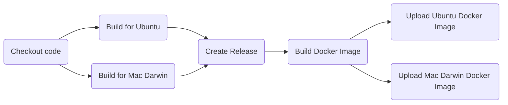

Sys-Echo
Sys-Echo is a small Go web server application that echoes the system environment variables. This README provides instructions on how to use the GitHub Actions workflow to build and release the application and create a Docker image with the sys-echo command.

### GitHub Actions Workflow
The GitHub Actions workflow is defined in the .github/workflows/build-and-release.yml file. It consists of several steps that build the application for Ubuntu and Mac Darwin, create a GitHub release for the built binaries, and create a Docker image with the sys-echo command.

Here's a diagram that illustrates the workflow using MermaidJS:

The workflow starts by checking out the code from the repository. Then, it builds the application for Ubuntu and Mac Darwin using the go build command. The built binaries are named sys-echo-linux and sys-echo-darwin to differentiate between the two output binaries.

After building the binaries, the workflow creates a GitHub release using the actions/create-release action. The release includes both binaries and the commit messages associated with the push event that triggered the workflow. The release is tagged with the git ref that triggered the workflow, prefixed with a v.

The final step of the workflow is to build a Docker image with the sys-echo command using the docker/build-push-action action. The Docker image is built from the Dockerfile in the root directory of the repository, which installs any dependencies needed for the app, copies the sys-echo binary into the container, and sets it as the main command. The Docker image is tagged with the name danfedick/sys-echo and the latest tag.

## Usage
To use this workflow in your own project, you can copy the .github/workflows/build-and-release.yml file to your repository and modify it as needed. You can also modify the Dockerfile to include any dependencies needed for your application.

To trigger the workflow, push a commit to the main branch of your repository. The workflow will automatically build the application for Ubuntu and Mac Darwin, create a GitHub release, and build a Docker image with the sys-echo command.

### Conclusion
In this README, we explained how to use the GitHub Actions workflow to build and release the Sys-Echo application and create a Docker image with the sys-echo command. We provided a diagram to illustrate the workflow using MermaidJS and instructions on how to use the workflow in your own project.

